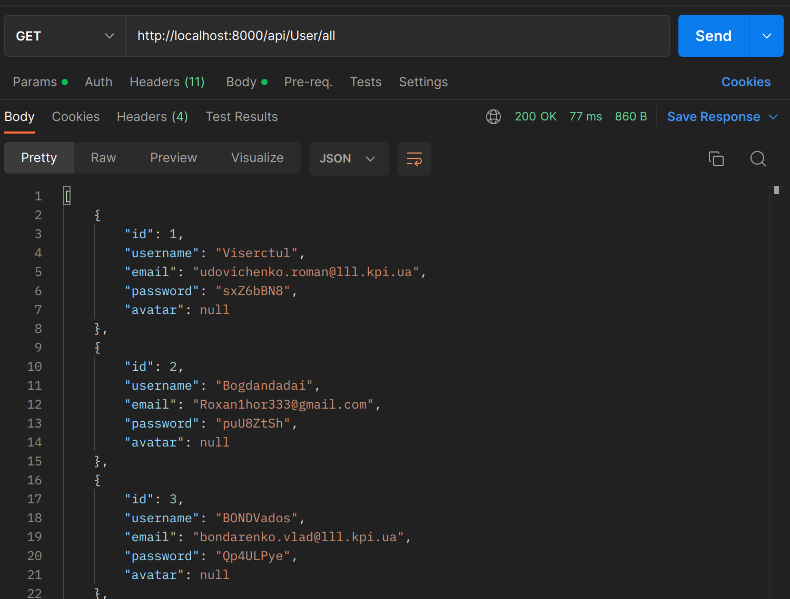
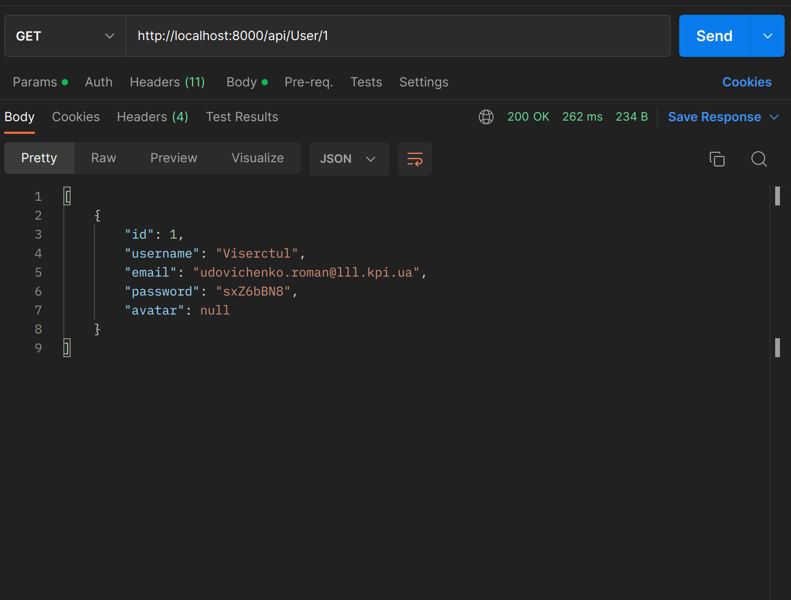
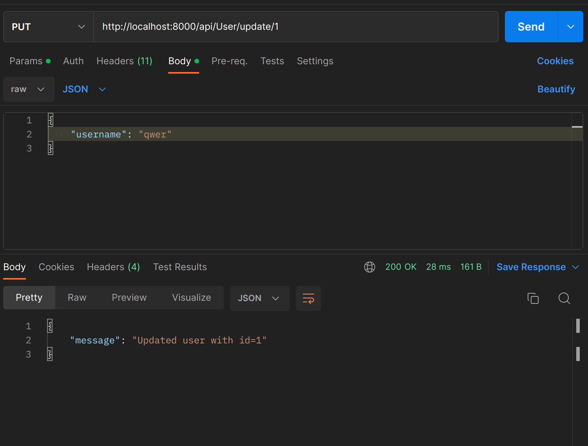
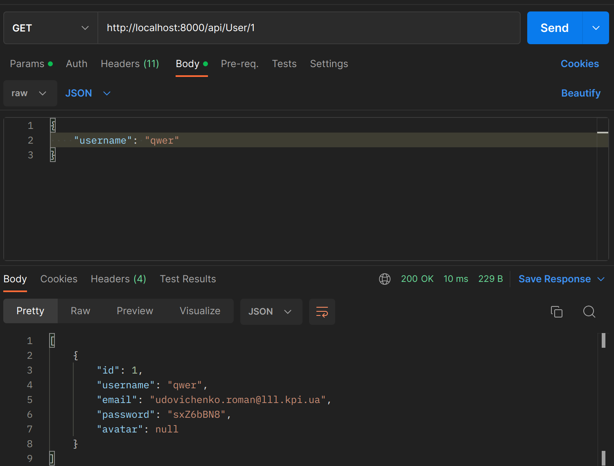
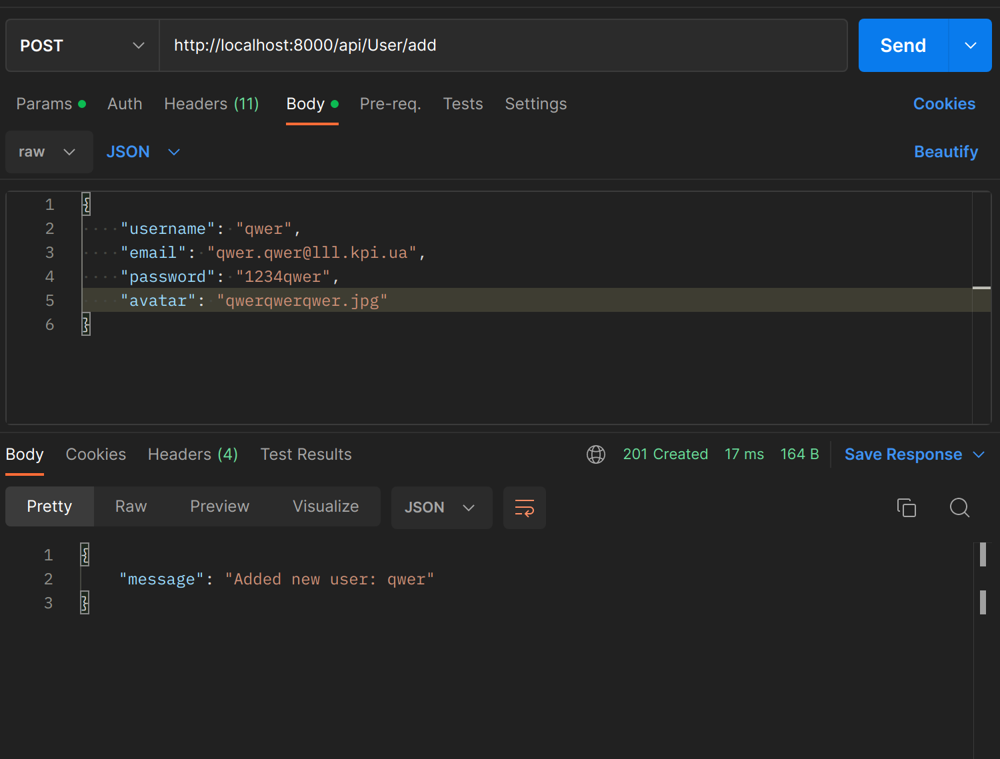
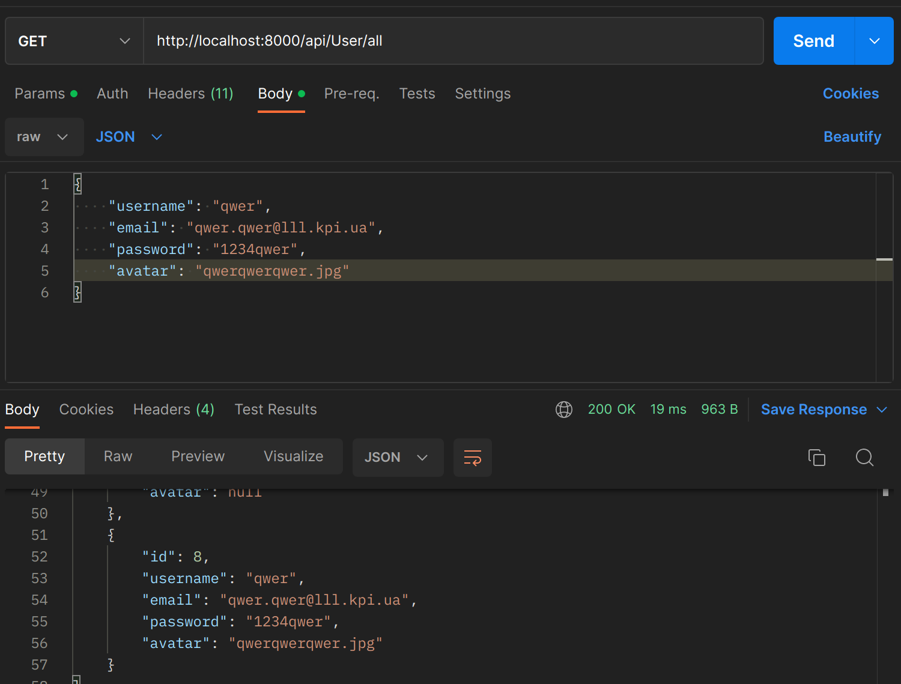
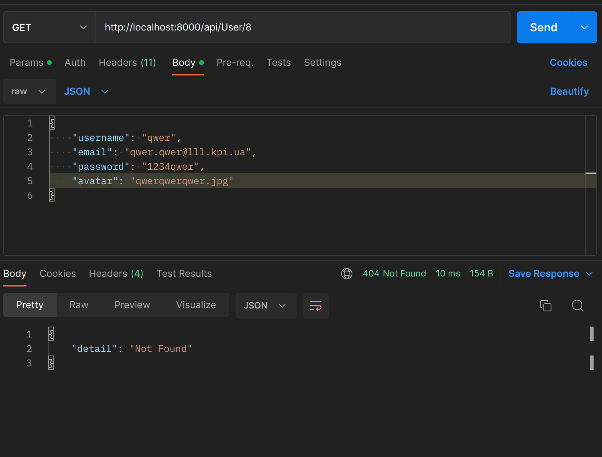

# Тестування працездатності системи
## Всі юзери.

## Один юзер.

## Змінюємо username юзера.

## Перевіряємо зміну username.

## Добавляємо нового юзера.

## Перевіряємо добавленого юзера.

## Видаляємо юзера.

## Перевіряємо видаленого юзера.

